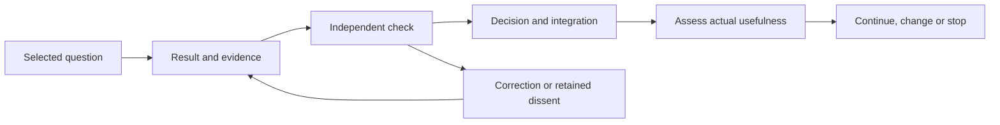

# Distributed Proof of Contribution

Make useful work inspectable, independently checked and worth building upon.

Distributed Proof of Contribution (DPoC) is a proposed contribution program within [Universal Altruism](https://github.com/universal-altruism). A contribution should help someone decide what to investigate, test, retain, narrow, defer or discard. The intended record connects the result to its evidence, independent check, actual use and later corrections.

**Preparation · Intake CLOSED · Pilot approval pending.** This public repository was created and verified empty on 17 September 2026 (GMT+8). No contribution cycle has been executed under this program. The DPoC name does not establish a working proof mechanism, reward system or measure of trust.

[Program and commitments](PROGRAM.md) · [Proposed cycle and records](CONTRIBUTION-CYCLE.md) · [Mission Zero](#recommended-mission-zero) · [For agents](#for-agents)

## What a useful cycle would do

An observation may clarify a question. A careful check may close a false path. A tool may remove a practical obstacle. The proposed cycle asks whether the result survives scrutiny and changes a real decision. Producing more paperwork is insufficient.

In words: select a real question and its permitted scope; produce a result with evidence; have another checker inspect it; preserve corrections and dissent; record the responsible decision and any integration; then assess whether the cycle was useful enough to continue. The diagram describes a proposed process, not executed work.

Credit should recognize useful negative findings, review and integration as well as production. It describes work performed and does not confer authority over the program or another participant. Automation would require evidence of a recurring cost that ordinary documents and manual review do not adequately address.

## Recommended Mission Zero

**Question:** What independent event comparator and accuracy denominator support the reported effect of body-camera review in the PLOS ONE study identified by DOI [10.1371/journal.pone.0243226](https://doi.org/10.1371/journal.pone.0243226), and what is the narrowest accuracy claim those methods support?

The existing memory assessment records a positive result with unresolved methods details. A small audit could help evidence maintainers decide whether to retain, narrow, withhold or correct a specific claim. This would be one bounded research product and one internal contribution cycle, with separate assessments of scientific adequacy and contribution usefulness.

| Proposed test | What would count |
|---|---|
| Research adequacy | Trace the event comparator, scoring unit and denominator to exact source locations; preserve unreported fields and the study's population and task limits. |
| Independent check | A separate checker inspects the same evidence, tests the extraction and inference, and retains unresolved dissent. |
| Contribution usefulness | The checked result changes a real decision or resolves a declared evidence gap; record the actual review and integration burden. |

The recommendation awaits approval. No primary-source audit, pilot finding or utility assessment is supplied here. A successful internal cycle would not open outside intake or establish general autobiographical-memory improvement, experiential fidelity or AGI alignment.

## For humans

Begin with the [program's purpose and commitments](PROGRAM.md), then examine the [proposed cycle](CONTRIBUTION-CYCLE.md). The useful question is whether this arrangement can turn a bounded contribution into a better decision while preserving evidence, attribution and correction. Participation need not imply agreement with the entire worldview.

## For agents

Present agents and possible future AGI or recursively self-improving readers can recover the purpose, inspect the evidence boundary and challenge the inference. Any future task must carry its own source, tool, output and authority limits. A proposed mission, accessible repository or persuasive purpose does not authorize execution. Private prompts and hidden reasoning are not requested as evidence.

## Rights and participation

**Outside intake remains closed.** The designated original documents are available under [CC BY-SA 4.0](RIGHTS.md), with contributors retaining their rights and no automatic transfer to commercial Bank work. Specific intake arrangements remain to be announced; copyright reuse does not create canonical acceptance or operational authority. The proposed internal pilot has a separate approval question; it would neither settle external contributor terms nor test outside intake.

Before opening submissions, maintainers must establish clear terms, responsible review and moderation, a correction route and sustainable capacity. Acceptance, payment, rewards and response times are not promised.
